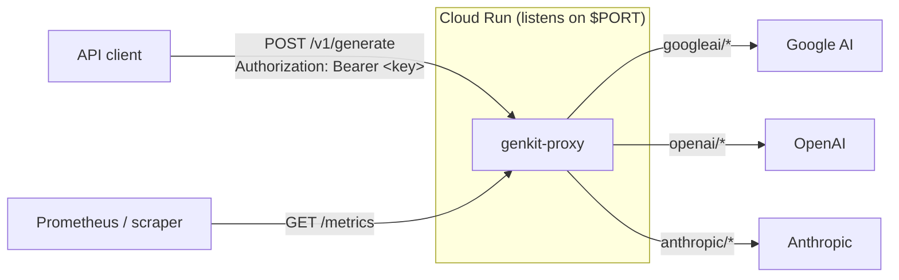
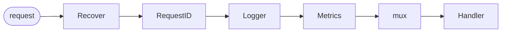

# genkit-proxy

A model-agnostic AI HTTP gateway built on [Firebase Genkit](https://firebase.google.com/docs/genkit).
It exposes a single `POST /v1/generate` endpoint and forwards each request to
Google AI, OpenAI, Anthropic, or Vertex AI — chosen from the model-name prefix.
For the API-key providers the key is supplied per request in the `Authorization`
header and never stored or shared: a fresh, single-provider Genkit plugin is built
for every request to keep tenant keys isolated. Vertex AI is the exception — it
authenticates with the proxy's own Google Cloud credentials (ADC), so those
requests are not per-tenant (see [supported providers](#supported-providers)).
The service listens on `$PORT` (default `8080`) and is ready to run on Cloud Run.

## Features

- **One unified endpoint** for multiple LLM providers — callers speak a single request/response shape, with an SSE streaming variant at `POST /v1/generate/stream`.
- **Provider routing by model prefix** — `googleai/…`, `openai/…`, `anthropic/…`, `vertexai/…` select the backend.
- **Per-request credentials** — the bearer token is passed straight through to the upstream provider; nothing is configured server-side. (Exception: `vertexai` uses the proxy's own GCP credentials via ADC, so its bearer is a gate only and is not forwarded.)
- **Generation controls & structured output** — optional `temperature`, `maxOutputTokens`, `topP`, `topK`, `stopSequences`, plus `responseFormat: "json"` with an optional `outputSchema` for machine-parseable JSON, and `messages` for multi-turn chat and multimodal (image/document) input.
- **Tool / function calling** — declare `tools` and the proxy returns the model's `toolCalls` for the client to run; results are sent back in a `tool`-role turn for a multi-step round-trip. Works on both endpoints (streaming surfaces calls in the `done` event).
- **Safe error handling** — upstream/provider failures are classified and reduced to generic messages so internal details never leak; caller mistakes are reported verbatim.
- **Observability** — structured `log/slog` logging with a per-request ID (`X-Request-ID`, UUID v4 fallback) and Prometheus metrics (request count, latency, and token counters) at `GET /metrics`.
- **Production lifecycle** — panic recovery, configurable HTTP timeouts, and graceful shutdown on `SIGINT`/`SIGTERM`.

### Supported providers

| Provider | Model prefix | Example model | Auth |
|----------|--------------|---------------|------|
| Google AI | `googleai` | `googleai/gemini-2.5-flash` | Bearer API key (per request) |
| OpenAI | `openai` | `openai/gpt-4o` | Bearer API key (per request) |
| Anthropic | `anthropic` | `anthropic/claude-3-5-sonnet` | Bearer API key (per request) |
| Vertex AI | `vertexai` | `vertexai/gemini-2.5-flash` | GCP ADC (server identity); bearer not forwarded |

Vertex AI authenticates with the proxy's Google Cloud Application Default
Credentials rather than a caller-supplied key, and reads its project/location
from `GOOGLE_CLOUD_PROJECT` and `GOOGLE_CLOUD_LOCATION` (or `GOOGLE_CLOUD_REGION`).
A bearer token is still required on every request as a coarse access gate, but
for `vertexai` it is **not** sent upstream — those calls run under the proxy's
shared GCP identity and billing. Per-tenant gateway auth is tracked separately in
[`TODO.md`](TODO.md).

## Architecture

A caller speaks one request/response shape; the proxy selects a provider from the
model-name prefix and forwards the request with the caller-supplied key.



Every request passes through a four-layer middleware chain before reaching the
handler:



See [`docs/architecture.md`](docs/architecture.md) for the full request
lifecycle, provider routing, and process lifecycle diagrams.

## Documentation

| Doc | Contents |
|-----|----------|
| [Architecture](docs/architecture.md) | System context, components, middleware, request and process lifecycle (diagrams). |
| [API reference](docs/api.md) | Every endpoint with schemas, status codes, and a per-endpoint sequence diagram. |
| [Error handling](docs/error-handling.md) | Error classification flow and the category → status → message mapping. |
| [Observability](docs/observability.md) | Request IDs, structured logging, and Prometheus metrics. |
| [Deployment](docs/deployment.md) | Container build, CI/CD pipeline, runtime config, and shutdown. |
| [Manual testing](docs/manual-testing.md) | Offline and provider integration checks with `curl`. |

## API

### `POST /v1/generate`

Requires an `Authorization: Bearer <api-key>` header carrying the upstream
provider's API key.

**Request body**

```json
{
  "modelName": "googleai/gemini-2.5-flash",
  "userMessage": "Say hello.",
  "systemPrompt": "You are a concise assistant.",
  "temperature": 0.7
}
```

| Field | Required | Description |
|-------|----------|-------------|
| `modelName` | yes | Provider-prefixed model identifier; the prefix selects the provider. |
| `userMessage` | conditional | The current user prompt. Required unless `messages` is provided. |
| `systemPrompt` | no | Optional system instruction. |
| `temperature` | no | Sampling randomness, `0`–`2`. Provider default when omitted. |
| `maxOutputTokens` / `topP` / `topK` | no | Generation controls (`≥ 1` / `0`–`1` / `≥ 1`). Provider defaults when omitted. |
| `stopSequences` | no | Strings that halt generation when produced. |
| `responseFormat` | no | `"json"` requests structured JSON output (optionally constrained by `outputSchema`, a JSON Schema). |
| `messages` | no | Conversation turns (role `"user"`/`"model"`/`"tool"`) for multi-turn chat, multimodal input, and tool round-trips. Each entry carries `content` (text) or `parts` — a list of `{"text"}` / `{"media":{"contentType","url"}}` / `{"toolRequest":…}` / `{"toolResponse":…}`. A request needs `userMessage` or `messages`. |
| `tools` / `toolChoice` | no | Declare callable `tools` (`{"name","description"?,"inputSchema"?}`, unique names); the model's calls come back in `toolCalls`. `toolChoice` is `"auto"`/`"required"`/`"none"`. See the tool-calling round-trip in [`docs/api.md`](docs/api.md#tool-calling). |

See [`docs/api.md`](docs/api.md) for the full field reference and bounds.

**Response body**

```json
{
  "model": "googleai/gemini-2.5-flash",
  "output": "Hello!",
  "finishReason": "stop",
  "usage": { "input": 12, "output": 3, "total": 15 }
}
```

`output` may be empty when the model returned no text (for example a safety
block); inspect `finishReason` in that case. Common reasons: `stop`, `length`,
`blocked`, `interrupted`, `other`, `unknown`. `usage` is omitted when the
provider reports no token counts. When `responseFormat: "json"` is requested,
valid JSON is returned inline in a `data` object instead of `output`. When the
model calls a declared tool, `output` is empty and `toolCalls` lists the
requested calls for the client to run.

**Example**

```bash
curl -sS http://localhost:8080/v1/generate \
  -H "Authorization: Bearer $PROVIDER_API_KEY" \
  -H "Content-Type: application/json" \
  -d '{"modelName":"googleai/gemini-2.5-flash","userMessage":"Say hello."}'
```

### Errors

Errors are returned as JSON:

```json
{ "error": "upstream provider rejected the supplied credentials" }
```

| Status | Cause |
|--------|-------|
| `400` | Invalid request (bad JSON, neither `userMessage` nor `messages`, an out-of-range tuning field, invalid `responseFormat`/`outputSchema`, a malformed `messages`/`parts`/`media` entry, a missing/duplicate `tools` name, or invalid `toolChoice`) or unsupported provider. |
| `401` | Missing/malformed bearer token, or upstream rejected the credentials. |
| `403` | Upstream provider denied access. |
| `404` | Requested model not found. |
| `405` | Wrong HTTP method. |
| `429` | Upstream rate limit exceeded. |
| `500` | Recovered panic in the handler. |
| `502` | Other upstream provider error. |
| `504` | Upstream request timed out. |

### Streaming

`POST /v1/generate/stream` takes the same request body and streams the
completion as Server-Sent Events: a `chunk` event (`{"delta":"…"}`) per text
delta, a terminating `done` event (`{"model","finishReason","usage"}`), and an
`error` event if generation fails after streaming has begun. See
[`docs/api.md`](docs/api.md#post-v1generatestream) for the event reference.

```bash
curl -N -sS http://localhost:8080/v1/generate/stream \
  -H "Authorization: Bearer $PROVIDER_API_KEY" \
  -d '{"modelName":"googleai/gemini-2.5-flash","userMessage":"Tell me a short story."}'
```

### Operational endpoints

| Endpoint | Purpose |
|----------|---------|
| `GET /healthz` | Liveness probe (always `200`). |
| `GET /readyz` | Readiness probe (always `200`). |
| `GET /version` | Returns `{"version","buildTime"}`, embedded at build time. |

## Configuration

All configuration is via environment variables; every variable is optional and
falls back to the default below. Duration values use Go's
[`time.ParseDuration`](https://pkg.go.dev/time#ParseDuration) format (e.g.
`30s`, `2m`, `500ms`). LLM credentials are **not** configured here — they are
supplied per request in the `Authorization` header.

| Variable | Default | Description |
|----------|---------|-------------|
| `PORT` | `8080` | HTTP listen port. |
| `READ_HEADER_TIMEOUT` | `10s` | Max time to read request headers. |
| `READ_TIMEOUT` | `30s` | Max time to read the request. |
| `WRITE_TIMEOUT` | `120s` | Max time to write the response. |
| `IDLE_TIMEOUT` | `60s` | Max keep-alive idle time. |
| `GENERATE_TIMEOUT` | `30s` | Max time for the upstream generation call. |

The variables above are read by the proxy itself. **Vertex AI** additionally
relies on standard Google Cloud environment, read by the Genkit/GCP SDK (not by
the proxy), and only needed when serving `vertexai/…` models:

| Variable | Description |
|----------|-------------|
| `GOOGLE_CLOUD_PROJECT` | GCP project for Vertex AI requests. |
| `GOOGLE_CLOUD_LOCATION` / `GOOGLE_CLOUD_REGION` | Vertex AI location/region. |
| `GOOGLE_APPLICATION_CREDENTIALS` | ADC credentials (auto-provided by the service account on Cloud Run). |

## Quick start

Requires Go (the version is pinned in `go.mod` / `.go-version`;
`GOTOOLCHAIN=auto` downloads it automatically on first use).

```bash
go run ./cmd/app          # starts the server on :8080
```

Then call it (see the `curl` example above). Optionally install the dev tooling
once per machine with `make tools`.

## Development

Common commands (each has a `make` wrapper):

```bash
go build ./...                  # make build
golangci-lint run ./...         # make lint
golangci-lint fmt               # make fmt        (check-only: make fmt-check)
gotestsum -- -race ./...        # make test-race
govulncheck ./...               # make vuln
go-licenses check ./...         # make licenses
air                             # make watch — live reload
make ci                         # full gate: fmt-check, vet, lint, test-race, vuln
```

See [`docs/manual-testing.md`](docs/manual-testing.md) for offline validation
checks and provider integration testing with `curl`.

### Project layout

```
cmd/app/            Server binary: config loading, routing, lifecycle.
internal/proxy/     Core gateway:
  proxy.go            HTTP handler — decode, authorize, respond.
  stream.go           SSE streaming handler for /v1/generate/stream.
  generator.go        Genkit-backed generation per request.
  router.go           Provider selection and plugin construction.
  request.go          Request/response types and validation.
  errors.go           Error classification and client-safe messages.
  middleware.go       Recover, RequestID, and Logger middleware.
```

Conventions for commits, branches, and PRs live in `CLAUDE.md` and the
`.claude/` directory.

## Deployment

The multi-stage [`Dockerfile`](Dockerfile) builds a static binary into a
distroless `nonroot` image and embeds the version via the `VCS_REF` and
`BUILD_TIME` build args. On a pushed `v*.*.*` tag, `.github/workflows/release.yml`
deploys to Google Cloud Run; `.github/workflows/bump-version.yml` derives and
pushes the next version tag from Conventional Commit messages on `main`.
