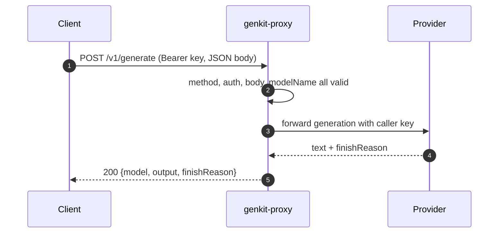
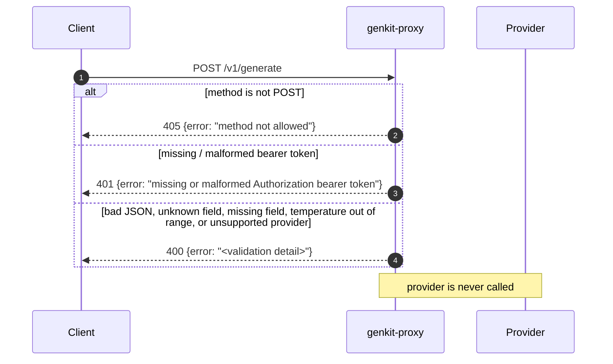
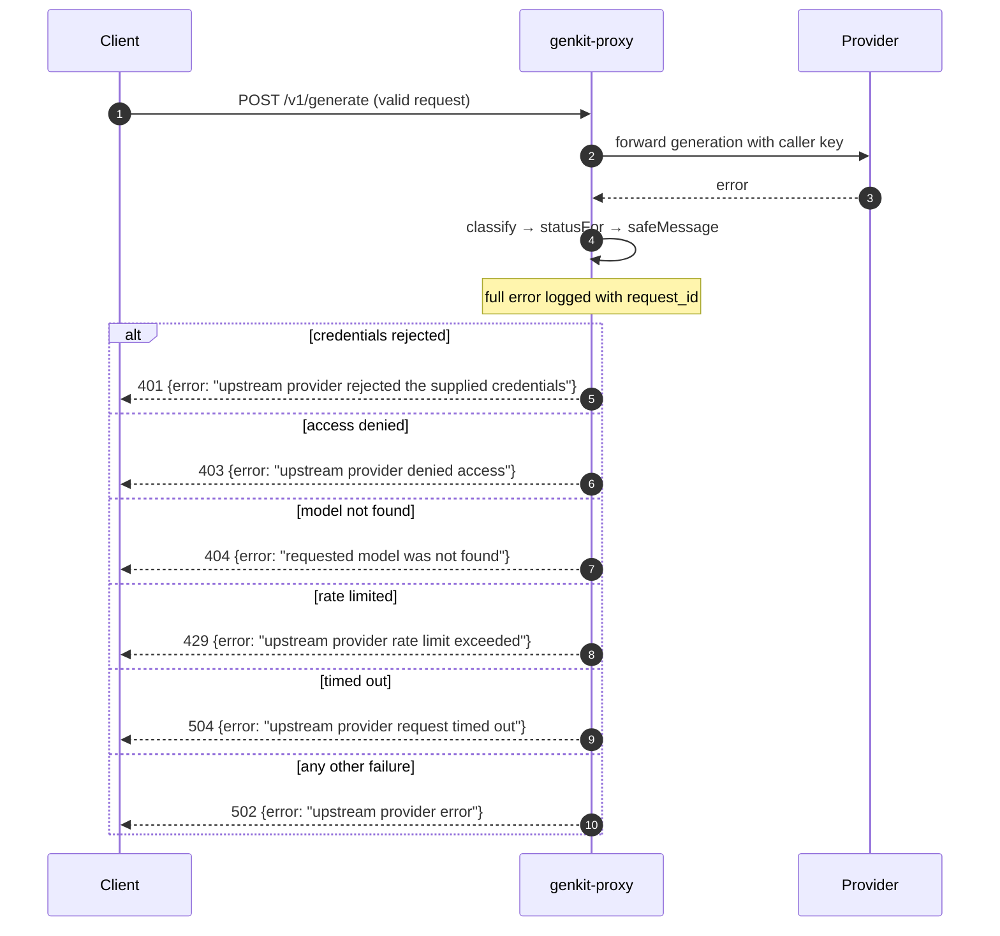
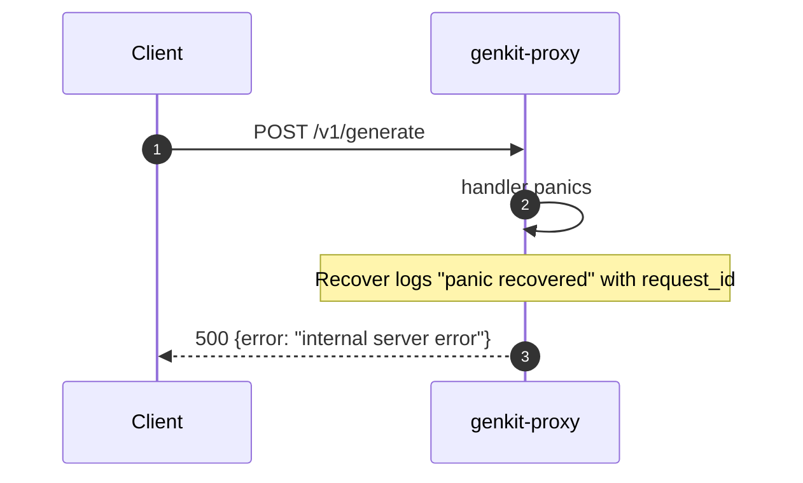
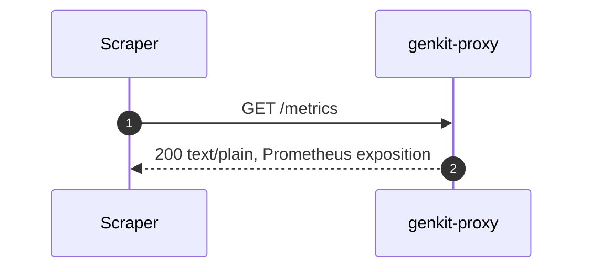
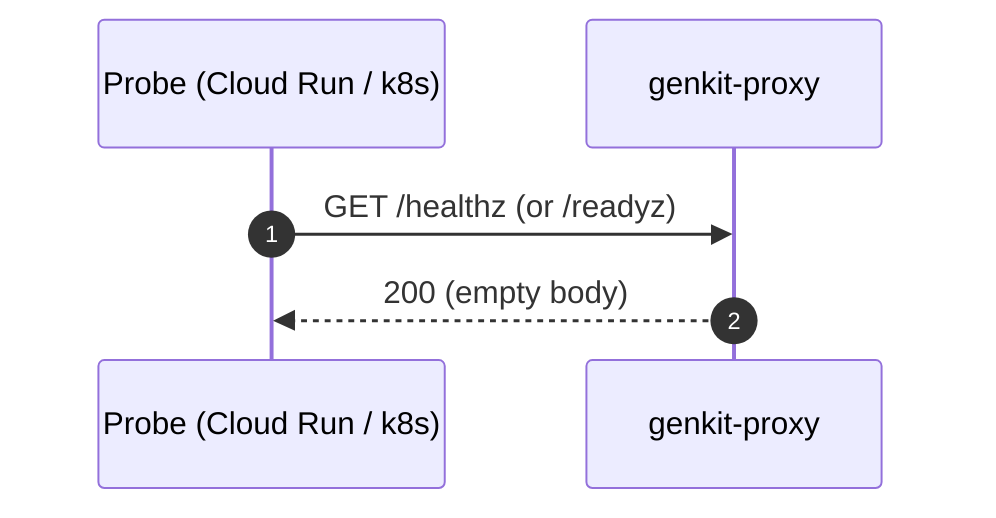
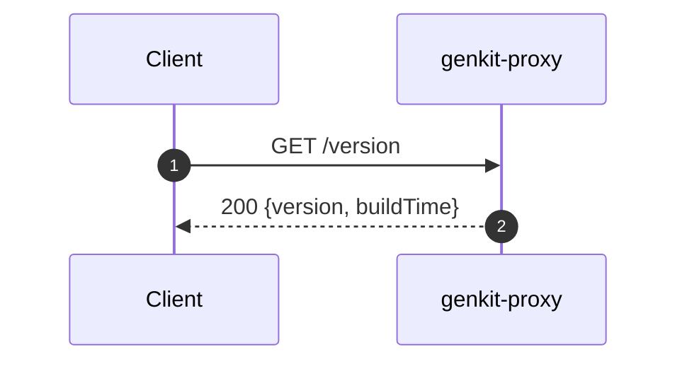

# API reference

The proxy exposes one generation endpoint and four operational endpoints. All
endpoints run through the full middleware chain (panic recovery, request ID,
access logging, metrics) described in [architecture](architecture.md). Every
response is JSON unless noted.

| Method | Path | Auth | Purpose |
|--------|------|------|---------|
| `POST` | `/v1/generate` | Bearer | Generate a completion via the selected provider. |
| `GET` | `/metrics` | none | Prometheus exposition of request metrics. |
| `GET` | `/healthz` | none | Liveness probe. |
| `GET` | `/readyz` | none | Readiness probe. |
| `GET` | `/version` | none | Build version and timestamp. |

---

## `POST /v1/generate`

Generates a completion. The provider is chosen from the `modelName` prefix; the
`Authorization: Bearer <api-key>` header carries that provider's API key, which
is forwarded upstream and never stored.

### Request

Headers:

| Header | Required | Notes |
|--------|----------|-------|
| `Authorization` | yes | `Bearer <api-key>`. Scheme is case-insensitive (RFC 7235). |
| `Content-Type` | recommended | `application/json`. |

Body (`GenerateRequest`, max 1 MiB, unknown fields rejected):

| Field | Type | Required | Description |
|-------|------|----------|-------------|
| `modelName` | string | yes | Provider-prefixed model id; the prefix selects the provider. |
| `userMessage` | string | yes | The user prompt. |
| `systemPrompt` | string | no | Optional system instruction. |
| `temperature` | number | no | Sampling randomness, `0`–`2`. Provider default when omitted. |

```json
{
  "modelName": "googleai/gemini-2.5-flash",
  "userMessage": "Say hello.",
  "systemPrompt": "You are a concise assistant.",
  "temperature": 0.7
}
```

### Response

`200 OK` with a `GenerateResponse`:

| Field | Type | Description |
|-------|------|-------------|
| `model` | string | Echoes the model that served the request. |
| `output` | string | Generated text. Empty when the model returned no text (e.g. a safety block). |
| `finishReason` | string | Why the model stopped. Omitted when the provider reports none. |

```json
{
  "model": "googleai/gemini-2.5-flash",
  "output": "Hello!",
  "finishReason": "stop"
}
```

`finishReason` common values: `stop`, `length`, `blocked`, `interrupted`,
`other`, `unknown`. When `output` is empty, inspect `finishReason` to tell "the
model declined" (`blocked`) from "the model returned an empty string".

### Status codes

| Status | Cause |
|--------|-------|
| `200` | Success. |
| `400` | Invalid request (bad JSON, unknown field, missing field, temperature out of range) or unsupported provider. |
| `401` | Missing/malformed bearer token, or upstream rejected the credentials. |
| `403` | Upstream provider denied access. |
| `404` | Requested model not found. |
| `405` | Method other than `POST`. |
| `429` | Upstream rate limit exceeded. |
| `500` | Recovered panic in the handler. |
| `502` | Other upstream provider error. |
| `504` | Upstream request timed out. |

Errors are returned as `{"error": "<message>"}`. Caller mistakes are reported
verbatim; upstream failures are reduced to generic messages so internal details
never leak — see [error handling](error-handling.md) for the full mapping.

### Sequences

#### Success

A valid request whose upstream generation succeeds.



#### Request rejected before the provider is called

Method, auth, and validation failures are caught locally — the provider is never
contacted, so these responses cost nothing upstream and the message is returned
verbatim.



#### Upstream provider error

The request is valid and forwarded, but the provider fails. The error is
classified and reduced to a generic, category-based message; the raw error is
logged server-side only.



See [error handling](error-handling.md) for how each provider error maps to these
categories.

#### Internal error (panic)

If the handler panics, the `Recover` middleware logs it and returns a generic
`500` (provided no response bytes were written yet).




### Examples

```bash
# Google AI
curl -sS http://localhost:8080/v1/generate \
  -H "Authorization: Bearer $GOOGLEAI_API_KEY" \
  -H "Content-Type: application/json" \
  -d '{"modelName":"googleai/gemini-2.5-flash","userMessage":"Say hello."}'

# OpenAI
curl -sS http://localhost:8080/v1/generate \
  -H "Authorization: Bearer $OPENAI_API_KEY" \
  -d '{"modelName":"openai/gpt-4o","userMessage":"Say hello."}'

# Anthropic
curl -sS http://localhost:8080/v1/generate \
  -H "Authorization: Bearer $ANTHROPIC_API_KEY" \
  -d '{"modelName":"anthropic/claude-3-5-sonnet","userMessage":"Say hello."}'
```

---

## `GET /metrics`

Prometheus exposition of this service's metrics only (a dedicated registry, with
OpenTelemetry scope/target info disabled). No auth. See
[observability](observability.md) for the instruments and labels.



---

## `GET /healthz` and `GET /readyz`

Liveness and readiness probes. Both always return `200` with an empty body —
they confirm the process is up and serving, and do not call any provider. They
flow through the same middleware chain as every other route.



```bash
curl -i localhost:8080/healthz   # 200, empty body
curl -i localhost:8080/readyz    # 200, empty body
```

---

## `GET /version`

Returns build metadata embedded at link time via `-ldflags -X` (defaults
`dev` / `unknown` for local builds).

```json
{ "version": "1a2b3c4", "buildTime": "2026-06-18T10:00:00Z" }
```



```bash
curl -s localhost:8080/version
```
