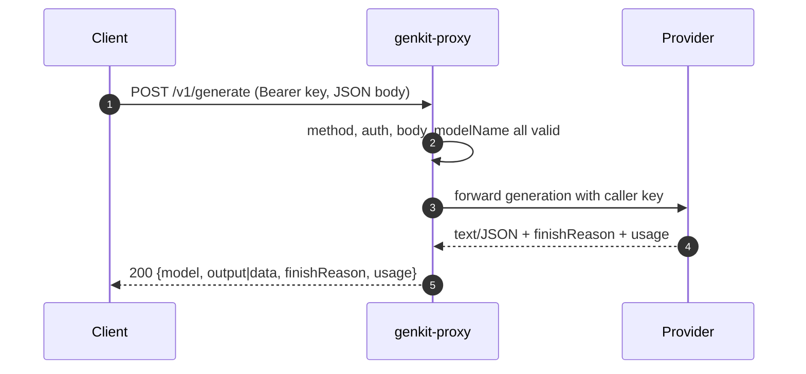
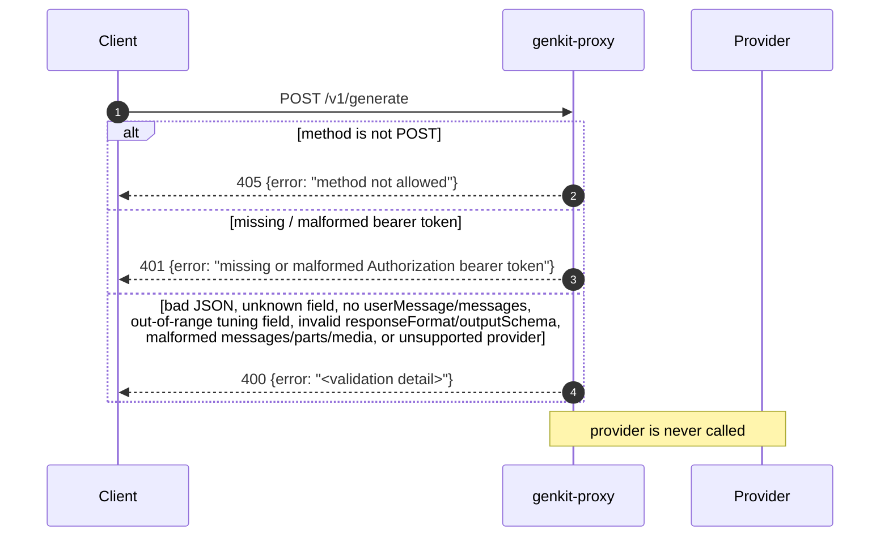
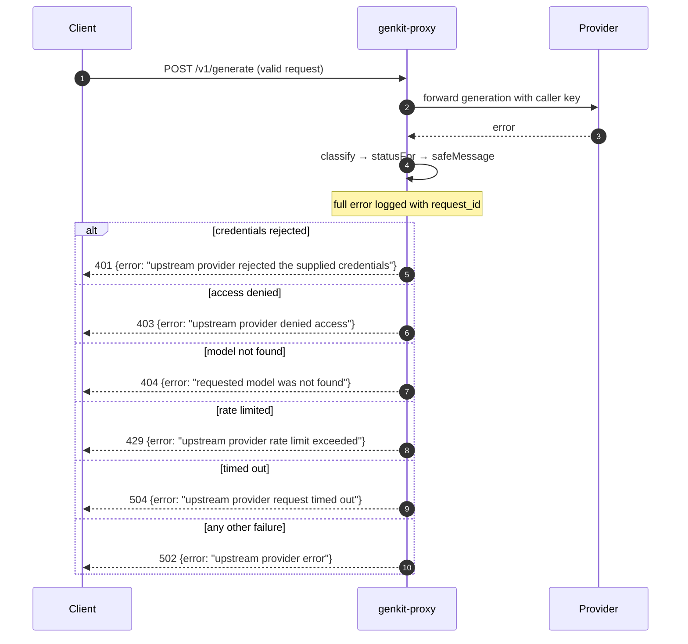
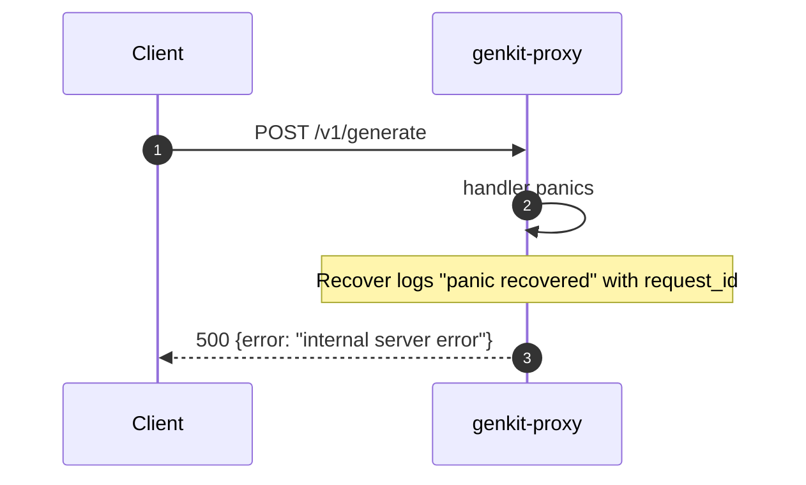
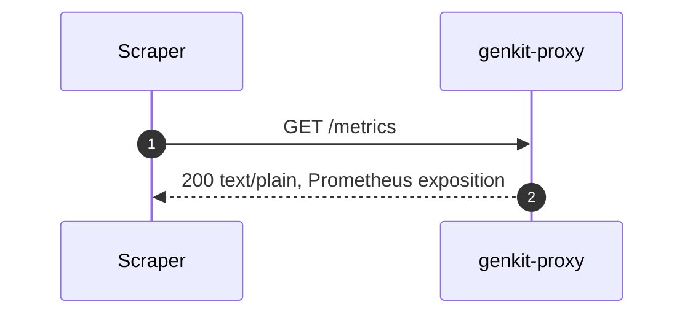
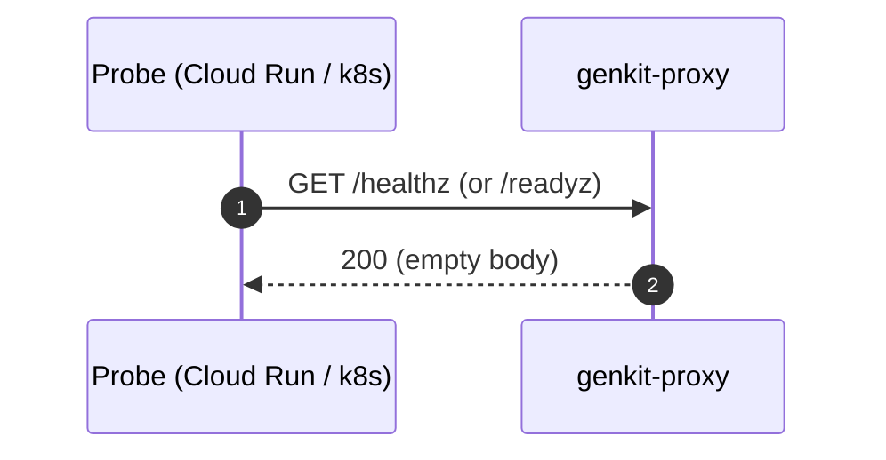
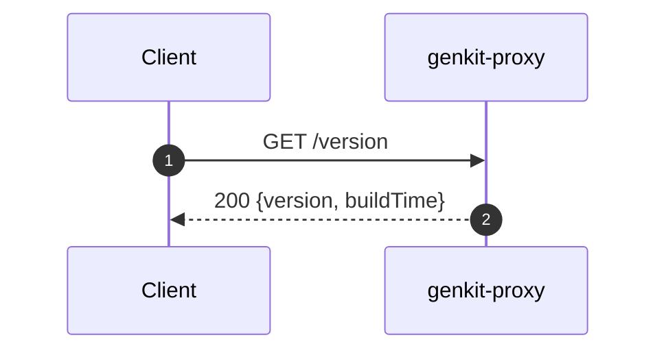

# API reference

The proxy exposes one generation endpoint and four operational endpoints. All
endpoints run through the full middleware chain (panic recovery, request ID,
access logging, metrics) described in [architecture](architecture.md). Every
response is JSON unless noted.

| Method | Path | Auth | Purpose |
|--------|------|------|---------|
| `POST` | `/v1/generate` | Bearer | Generate a completion via the selected provider. |
| `POST` | `/v1/generate/stream` | Bearer | Stream a completion as Server-Sent Events. |
| `GET` | `/metrics` | none | Prometheus exposition of request metrics. |
| `GET` | `/healthz` | none | Liveness probe. |
| `GET` | `/readyz` | none | Readiness probe. |
| `GET` | `/version` | none | Build version and timestamp. |

---

## `POST /v1/generate`

Generates a completion. The provider is chosen from the `modelName` prefix; the
`Authorization: Bearer <api-key>` header carries that provider's API key, which
is forwarded upstream and never stored. The exception is `vertexai`, which
authenticates with the proxy's Google Cloud credentials (ADC): a bearer token is
still required as a coarse gate but is **not** forwarded upstream, and the
project/location come from `GOOGLE_CLOUD_PROJECT` / `GOOGLE_CLOUD_LOCATION` (see
[architecture](architecture.md#provider-routing)).

### Request

Headers:

| Header | Required | Notes |
|--------|----------|-------|
| `Authorization` | yes | `Bearer <api-key>`. Scheme is case-insensitive (RFC 7235). |
| `Content-Type` | recommended | `application/json`. |

Body (`GenerateRequest`, max 1 MiB, unknown fields rejected):

| Field | Type | Required | Description |
|-------|------|----------|-------------|
| `modelName` | string | yes | Provider-prefixed model id; the prefix selects the provider. |
| `userMessage` | string | conditional | The current user prompt. Required **unless** `messages` is provided. |
| `systemPrompt` | string | no | Optional system instruction. |
| `temperature` | number | no | Sampling randomness, `0`–`2`. Provider default when omitted. |
| `maxOutputTokens` | integer | no | Caps generated tokens, `≥ 1`. Provider default when omitted. |
| `topP` | number | no | Nucleus-sampling mass, `0`–`1`. Provider default when omitted. |
| `topK` | integer | no | Limits sampling to the K likeliest tokens, `≥ 1`. Provider default when omitted. |
| `stopSequences` | string[] | no | Strings that halt generation when produced. |
| `responseFormat` | string | no | `"json"` requests structured JSON output. Omit for plain text. |
| `outputSchema` | object | no | A JSON Schema the JSON output must conform to. Valid only with `responseFormat: "json"`. |
| `messages` | object[] | no | Conversation turns sent before `userMessage`. Each entry has a `role` (`"user"`, `"model"`, or `"tool"`) and **exactly one** of `content` (text) or `parts`. |
| `tools` | object[] | no | Tools the model may call. Each entry is `{"name","description"?,"inputSchema"?}` (`inputSchema` is a JSON Schema for the arguments; an open object schema is used when omitted). Names must be unique. See [tool calling](#tool-calling). |
| `toolChoice` | string | no | Constrains tool use: `"auto"`, `"required"`, or `"none"`. Provider default when omitted. |

Each `parts` entry has **exactly one** of:

| Field | Type | Description |
|-------|------|-------------|
| `text` | string | A plain-text part. |
| `media` | object | `{"contentType","url"}` — `contentType` is a MIME type (e.g. `image/png`); `url` is an `https://` URL or a `data:` URL with embedded base64. |
| `toolRequest` | object | `{"name","ref"?,"input"?}` — a tool call previously emitted by the model, replayed in a `"model"` turn so the model has context for the matching result. |
| `toolResponse` | object | `{"name","ref"?,"output"?}` — the result of running a tool the model requested, sent in a `"tool"` turn. `ref` should match the originating `toolRequest`. |

A request must include `userMessage`, `messages`, or both. Multimodal (vision/document)
input goes in a `messages` part with `media`. Note the **1 MiB body cap** limits inline
`data:` URLs; prefer `https://` URLs for large media.

```json
{
  "modelName": "googleai/gemini-2.5-flash",
  "userMessage": "Say hello.",
  "systemPrompt": "You are a concise assistant.",
  "temperature": 0.7
}
```

### Response

`200 OK` with a `GenerateResponse`:

| Field | Type | Description |
|-------|------|-------------|
| `model` | string | Echoes the model that served the request. |
| `output` | string | Generated text. Empty when the model returned no text (e.g. a safety block) or when JSON output was returned in `data`. |
| `finishReason` | string | Why the model stopped. Omitted when the provider reports none. |
| `data` | object | Structured JSON output, present only when `responseFormat: "json"` was requested and the model returned valid JSON. Mutually exclusive with text `output`. Omitted otherwise. |
| `toolCalls` | object[] | Tools the model wants the client to run, each `{"name","ref"?,"input"}`. Present only when `tools` were provided and the model chose to call one; `output` is then empty. See [tool calling](#tool-calling). |
| `usage` | object | Token counts `{input, output, total}`. Omitted when the provider reports none. |

```json
{
  "model": "googleai/gemini-2.5-flash",
  "output": "Hello!",
  "finishReason": "stop",
  "usage": { "input": 12, "output": 3, "total": 15 }
}
```

`finishReason` common values: `stop`, `length`, `blocked`, `interrupted`,
`other`, `unknown`. When `output` is empty, inspect `finishReason` to tell "the
model declined" (`blocked`) from "the model returned an empty string".

When the request sets `responseFormat: "json"`, valid JSON is returned inline in
`data` (and `output` is empty); if the model returns text that is not valid JSON,
it falls back to `output` so `data` is never malformed:

```json
{
  "model": "googleai/gemini-2.5-flash",
  "data": { "city": "Paris", "country": "France" },
  "finishReason": "stop",
  "usage": { "input": 18, "output": 9, "total": 27 }
}
```

### Tool calling

Pass `tools` to let the model call functions the client implements. The proxy is
stateless: it forwards the declarations to the provider and returns any tool
**calls** to the client — it never executes tools itself. Completing a call is a
client-driven round-trip:

1. **Send tools.** The request carries `tools` (and optionally `toolChoice`).

   ```json
   {
     "modelName": "googleai/gemini-2.5-flash",
     "userMessage": "What is the weather in SF?",
     "tools": [{
       "name": "get_weather",
       "description": "Look up the current weather for a city.",
       "inputSchema": {"type":"object","properties":{"city":{"type":"string"}},"required":["city"]}
     }]
   }
   ```

2. **Receive tool calls.** When the model decides to call a tool, the response
   carries `toolCalls` and an empty `output` (`finishReason` is typically `stop`):

   ```json
   { "model": "googleai/gemini-2.5-flash", "output": "",
     "toolCalls": [{"name":"get_weather","ref":"call_1","input":{"city":"SF"}}],
     "finishReason": "stop" }
   ```

3. **Run the tool and send results back.** Replay the conversation in `messages`
   — the model's tool-call turn as a `"model"` message with a `toolRequest` part,
   then the result as a `"tool"` message with a `toolResponse` part (matching
   `ref`) — and **resend `tools`**. The model then produces its final answer.

   ```json
   {
     "modelName": "googleai/gemini-2.5-flash",
     "tools": [{"name":"get_weather","description":"...","inputSchema":{"type":"object","properties":{"city":{"type":"string"}}}}],
     "messages": [
       {"role":"user","content":"What is the weather in SF?"},
       {"role":"model","parts":[{"toolRequest":{"name":"get_weather","ref":"call_1","input":{"city":"SF"}}}]},
       {"role":"tool","parts":[{"toolResponse":{"name":"get_weather","ref":"call_1","output":{"tempC":18,"sky":"clear"}}}]}
     ]
   }
   ```

Tools must be resent on every request because the proxy keeps no session state.
On the streaming endpoint, tool calls are delivered in the terminating `done`
event (see [`/v1/generate/stream`](#post-v1generatestream)).

### Status codes

| Status | Cause |
|--------|-------|
| `200` | Success. |
| `400` | Invalid request (bad JSON, unknown field, neither `userMessage` nor `messages`, an out-of-range tuning field — temperature / maxOutputTokens / topP / topK — an invalid `responseFormat` / `outputSchema`, a malformed `messages` / `parts` / `media` entry, a missing/duplicate `tools` name, or an invalid `toolChoice`) or unsupported provider. |
| `401` | Missing/malformed bearer token, or upstream rejected the credentials. |
| `403` | Upstream provider denied access, or the requested model is not permitted by the configured `MODEL_ALLOWLIST`. |
| `404` | Requested model not found. |
| `405` | Method other than `POST`. |
| `429` | Upstream rate limit exceeded. |
| `500` | Recovered panic in the handler. |
| `502` | Other upstream provider error. |
| `504` | Upstream request timed out. |

Errors are returned as `{"error": "<message>"}`. Caller mistakes are reported
verbatim; upstream failures are reduced to generic messages so internal details
never leak — see [error handling](error-handling.md) for the full mapping.

### Sequences

#### Success

A valid request whose upstream generation succeeds.



#### Request rejected before the provider is called

Method, auth, and validation failures are caught locally — the provider is never
contacted, so these responses cost nothing upstream and the message is returned
verbatim.



#### Upstream provider error

The request is valid and forwarded, but the provider fails. The error is
classified and reduced to a generic, category-based message; the raw error is
logged server-side only.



See [error handling](error-handling.md) for how each provider error maps to these
categories.

#### Internal error (panic)

If the handler panics, the `Recover` middleware logs it and returns a generic
`500` (provided no response bytes were written yet).




### Examples

```bash
# Google AI
curl -sS http://localhost:8080/v1/generate \
  -H "Authorization: Bearer $GOOGLEAI_API_KEY" \
  -H "Content-Type: application/json" \
  -d '{"modelName":"googleai/gemini-2.5-flash","userMessage":"Say hello."}'

# OpenAI
curl -sS http://localhost:8080/v1/generate \
  -H "Authorization: Bearer $OPENAI_API_KEY" \
  -d '{"modelName":"openai/gpt-4o","userMessage":"Say hello."}'

# Anthropic
curl -sS http://localhost:8080/v1/generate \
  -H "Authorization: Bearer $ANTHROPIC_API_KEY" \
  -d '{"modelName":"anthropic/claude-3-5-sonnet","userMessage":"Say hello."}'

# Structured JSON output, constrained to a schema (returned inline in "data")
curl -sS http://localhost:8080/v1/generate \
  -H "Authorization: Bearer $GOOGLEAI_API_KEY" \
  -H "Content-Type: application/json" \
  -d '{
        "modelName": "googleai/gemini-2.5-flash",
        "userMessage": "Where is the Eiffel Tower?",
        "responseFormat": "json",
        "outputSchema": {
          "type": "object",
          "properties": {"city": {"type": "string"}, "country": {"type": "string"}},
          "required": ["city", "country"]
        }
      }'

# Multi-turn chat: prior turns in "messages", the new turn in "userMessage"
curl -sS http://localhost:8080/v1/generate \
  -H "Authorization: Bearer $GOOGLEAI_API_KEY" \
  -H "Content-Type: application/json" \
  -d '{
        "modelName": "googleai/gemini-2.5-flash",
        "messages": [
          {"role": "user", "content": "My name is Ada."},
          {"role": "model", "content": "Nice to meet you, Ada."}
        ],
        "userMessage": "What is my name?"
      }'

# Vertex AI: authenticates via the proxy's GCP credentials (ADC); the bearer is a
# gate only and is not forwarded. Requires GOOGLE_CLOUD_PROJECT / GOOGLE_CLOUD_LOCATION.
curl -sS http://localhost:8080/v1/generate \
  -H "Authorization: Bearer any-gate-token" \
  -d '{"modelName":"vertexai/gemini-2.5-flash","userMessage":"Say hello."}'

# Multimodal (vision): text + image in one user turn via "messages" parts (no userMessage)
curl -sS http://localhost:8080/v1/generate \
  -H "Authorization: Bearer $GOOGLEAI_API_KEY" \
  -H "Content-Type: application/json" \
  -d '{
        "modelName": "googleai/gemini-2.5-flash",
        "messages": [
          {"role": "user", "parts": [
            {"text": "What is in this image?"},
            {"media": {"contentType": "image/png", "url": "https://example.com/cat.png"}}
          ]}
        ]
      }'
```

---

## `POST /v1/generate/stream`

Streams the same generation as it is produced, using
[Server-Sent Events](https://developer.mozilla.org/docs/Web/API/Server-sent_events).
The request body, headers, auth, and validation are **identical** to
`POST /v1/generate` (including the per-provider auth notes above).

On success the response is `200 OK` with `Content-Type: text/event-stream` and a
sequence of named events:

| Event | When | Data payload |
|-------|------|--------------|
| `chunk` | per text delta | `{"delta":"<text>"}` |
| `done` | once, at the end | `{"model","finishReason","toolCalls"?,"usage"}` (same fields as the non-stream response, minus `output`) |
| `error` | a failure **after** streaming began | `{"error":"<categorized message>"}` |

The streamed text is delivered only through `chunk` events; the `done` event
carries the finish reason, token usage, and any `toolCalls` (a tool-call turn
produces no text `chunk`s — the calls arrive in `done`). A failure **before** the first byte is
returned as an ordinary JSON error with the appropriate status (same status codes
and sanitization as `/v1/generate`) — not as an `error` event.

```
event: chunk
data: {"delta":"Hello"}

event: chunk
data: {"delta":" world"}

event: done
data: {"model":"googleai/gemini-2.5-flash","finishReason":"stop","usage":{"input":5,"output":2,"total":7}}
```

```bash
# -N disables curl's buffering so events print as they arrive.
curl -N -sS http://localhost:8080/v1/generate/stream \
  -H "Authorization: Bearer $GOOGLEAI_API_KEY" \
  -H "Content-Type: application/json" \
  -d '{"modelName":"googleai/gemini-2.5-flash","userMessage":"Tell me a short story."}'
```

The per-request generation timeout (`GENERATE_TIMEOUT`) bounds the stream; the
server's `WRITE_TIMEOUT` is not applied to streaming responses, so long
generations are not cut off mid-stream.

---

## `GET /metrics`

Prometheus exposition of this service's metrics only (a dedicated registry, with
OpenTelemetry scope/target info disabled). No auth. See
[observability](observability.md) for the instruments and labels.



---

## `GET /healthz` and `GET /readyz`

Liveness and readiness probes. Both always return `200` with an empty body —
they confirm the process is up and serving, and do not call any provider. They
flow through the same middleware chain as every other route.



```bash
curl -i localhost:8080/healthz   # 200, empty body
curl -i localhost:8080/readyz    # 200, empty body
```

---

## `GET /version`

Returns build metadata embedded at link time via `-ldflags -X` (defaults
`dev` / `unknown` for local builds).

```json
{ "version": "1a2b3c4", "buildTime": "2026-06-18T10:00:00Z" }
```



```bash
curl -s localhost:8080/version
```
