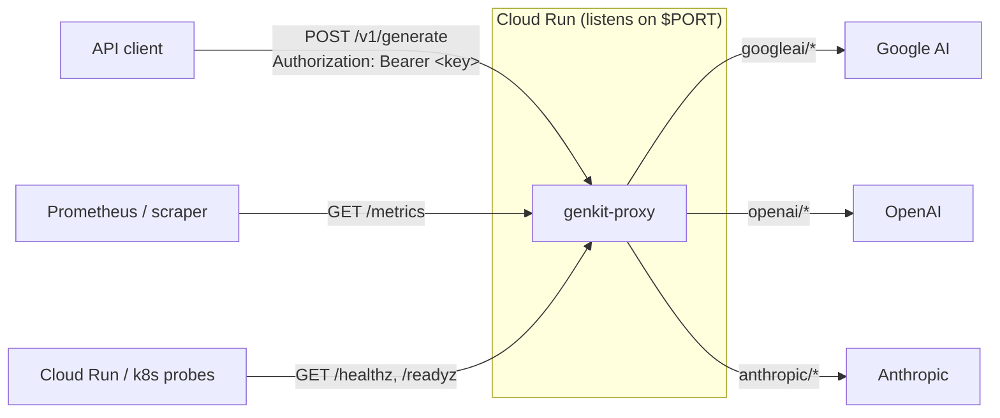
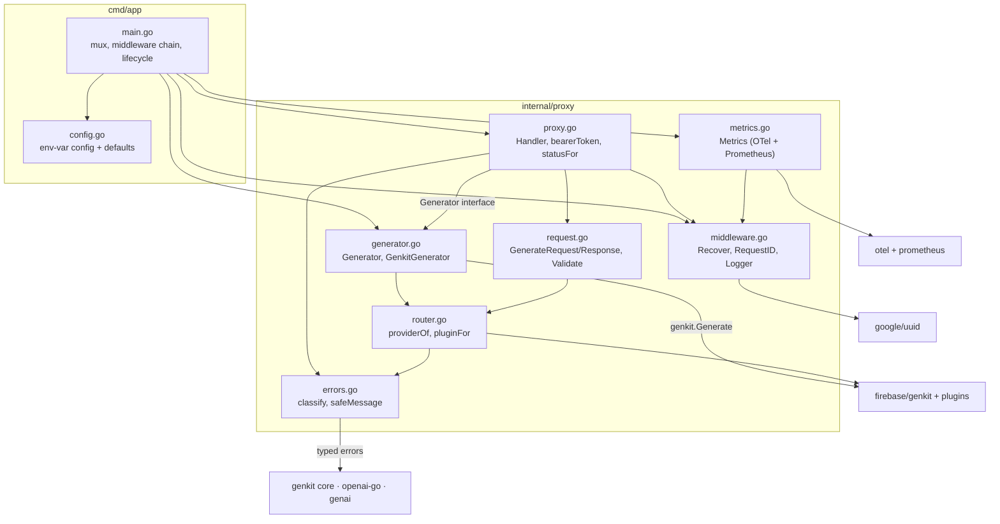
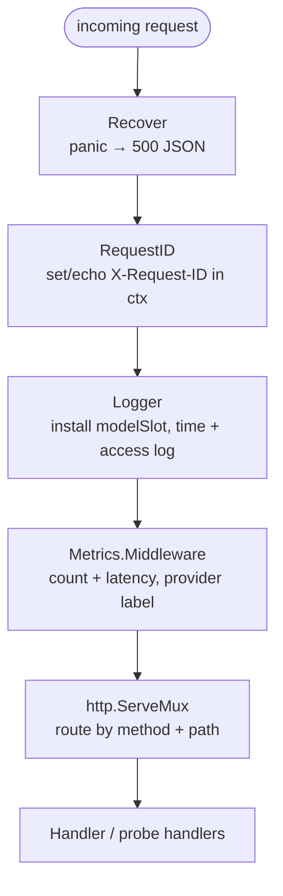
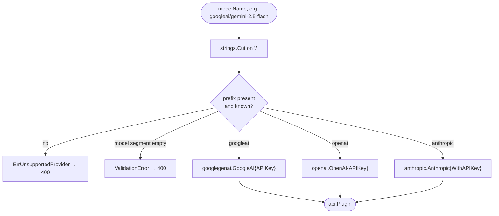
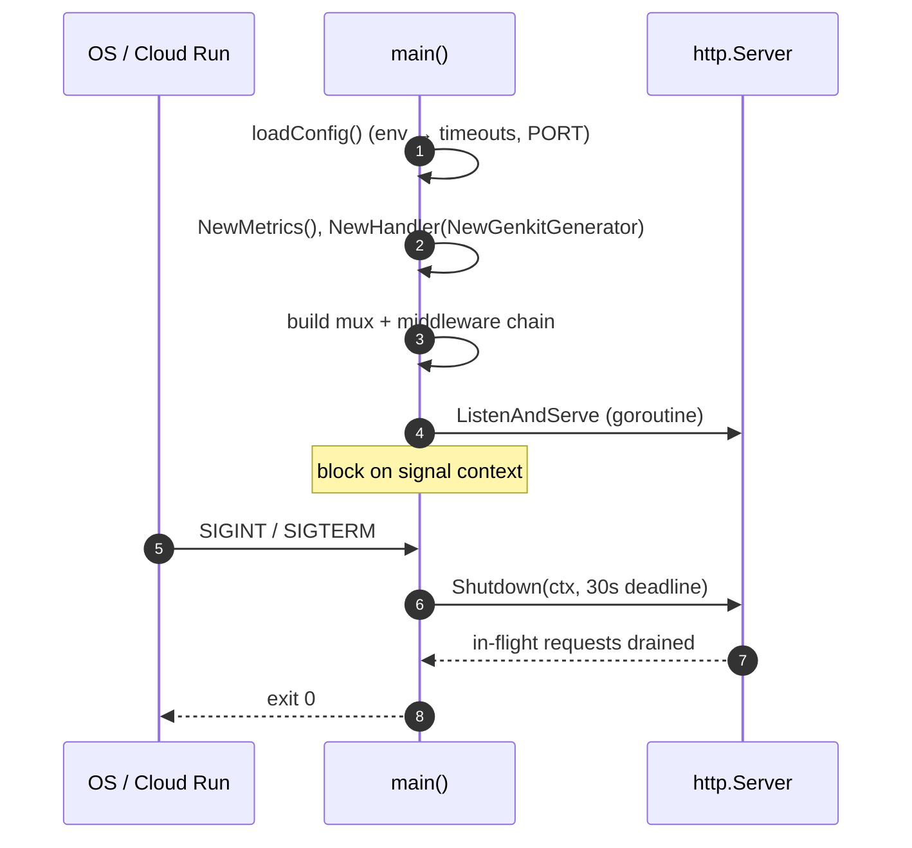

# Architecture

`genkit-proxy` is a model-agnostic AI HTTP gateway built on
[Firebase Genkit](https://firebase.google.com/docs/genkit). It exposes a single
generation endpoint, selects an LLM provider from the model-name prefix, and
forwards the request using the API key supplied per request — credentials are
never stored server-side. This document describes the runtime structure; see
also the [API reference](api.md), [error handling](error-handling.md),
[observability](observability.md), and [deployment](deployment.md).

## System context



The caller speaks one request/response shape regardless of provider. The bearer
token is passed straight through to the upstream provider; nothing is configured
server-side.

## Components

The codebase is one binary (`cmd/app`) wrapping one core package
(`internal/proxy`). Each file has a single responsibility.



Key abstraction: `Handler` depends on the `Generator` interface
(`generator.go:14`), not on Genkit directly, so the HTTP layer is tested with a
fake generator while `GenkitGenerator` carries the real upstream wiring.

## Middleware stack

`main.go:65` wraps the mux in four middlewares. They are listed outermost first;
a request passes through them top-to-bottom and the response unwinds
bottom-to-top.



**Ordering matters.** `Logger` installs a mutable `modelSlot` in the request
context; the `Handler` writes the decoded model name into it, and both `Logger`
and `Metrics.Middleware` read it afterward (for the `model` log field and the
`provider` metric label). `Metrics.Middleware` therefore runs *inside* `Logger`
and reuses its slot — falling back to its own slot only if `Logger` is absent
(`metrics.go:95-103`).

## Request lifecycle

The full internal path of a `POST /v1/generate` call, with the success and error
branches:

```mermaid
sequenceDiagram
    autonumber
    participant C as Client
    participant MW as Middleware chain
    participant H as Handler (proxy.go)
    participant R as Router (router.go)
    participant G as GenkitGenerator
    participant K as Genkit
    participant P as Provider

    C->>MW: POST /v1/generate + Bearer key + JSON
    MW->>H: ServeHTTP (ctx: request_id, modelSlot)
    H->>H: method == POST?
    H->>H: bearerToken() — parse Authorization
    H->>H: decode body (≤ 1 MiB, DisallowUnknownFields)
    H->>R: req.Validate() → providerOf(modelName)
    H->>H: modelSlot.name = modelName
    H->>G: Generate(ctx, req, apiKey)
    G->>R: pluginFor(modelName, apiKey)
    G->>K: genkit.Init(plugin) + Generate(opts)
    K->>P: upstream generation
    alt success
        P-->>K: text + finishReason
        K-->>G: response
        G-->>H: GenerateResponse
        H-->>C: 200 {model, output, finishReason}
    else error
        P-->>K: provider error
        K-->>G: error
        G-->>H: wrapped error
        H->>H: classify → statusFor → safeMessage
        Note over H: full error logged server-side;<br/>client gets generic message
        H-->>C: 4xx/5xx {error}
    end
    Note over MW: Logger writes access log;<br/>Metrics records count + latency
```

Validation, auth, and routing details live in the [API reference](api.md); error
classification is detailed in [error handling](error-handling.md).

## Provider routing

The provider is derived from the model name and never configured separately. A
fresh, single-provider plugin is built per request so tenant keys stay isolated
(Genkit binds credentials at plugin construction).



| Provider | Prefix | Plugin (Genkit) |
|----------|--------|-----------------|
| Google AI | `googleai` | `plugins/googlegenai` |
| OpenAI | `openai` | `plugins/compat_oai/openai` |
| Anthropic | `anthropic` | `plugins/compat_oai/anthropic` |

## Process lifecycle



The accept loop runs in a goroutine while `main` blocks on a
`signal.NotifyContext`. On `SIGINT`/`SIGTERM` it calls `srv.Shutdown` with a
30-second deadline to drain in-flight requests (`main.go:72-90`). The standard
`net/http` server already serves each request on its own goroutine; the handler
spawns none of its own.
