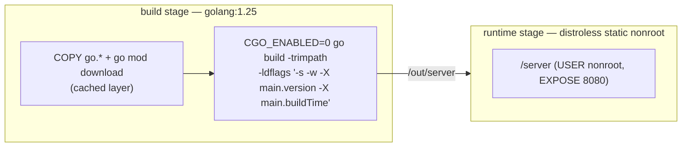
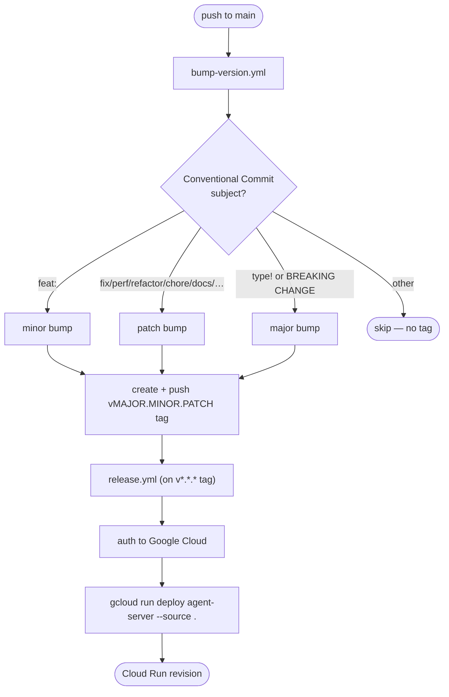

# Deployment

The service ships as a small static binary in a distroless image and deploys to
Google Cloud Run. Versioning and deployment are automated through GitHub Actions.

## Container image

The [`Dockerfile`](../Dockerfile) is a two-stage build: a `golang:1.25` stage
compiles a static, stripped binary, and a distroless `nonroot` stage runs it.
`VCS_REF` (git SHA) and `BUILD_TIME` are passed as build args and embedded via
`-ldflags -X` into the `/version` endpoint.

## CI/CD pipeline

Two workflows under [`.github/workflows/`](../.github/workflows) turn a merge to
`main` into a deployed revision.

- **[`bump-version.yml`](../.github/workflows/bump-version.yml)** runs on every
  push to `main`. It derives the next SemVer from the latest `v*.*.*` tag and the
  commit subject's Conventional Commit type, then tags and pushes. Commits that
  don't match a known type produce no tag.
- **[`release.yml`](../.github/workflows/release.yml)** runs on a pushed
  `v[0-9]+.[0-9]+.[0-9]+` tag. It authenticates to Google Cloud and runs
  `gcloud run deploy ... --source .`, which builds the repo-root `Dockerfile` via
  Cloud Build and deploys to the `agent-server` Cloud Run service.

Required configuration: secrets `APP_ID` / `APP_PRIVATE_KEY` (GitHub App token
for tagging) and `GCP_SERVICE_ACCOUNT`; repository variables `GCP_PROJECT` and
`GCP_REGION`.

## Runtime configuration

All configuration is via environment variables; every variable is optional and
falls back to the default below. Durations use Go's
[`time.ParseDuration`](https://pkg.go.dev/time#ParseDuration) format
(`30s`, `2m`, `500ms`). A present-but-invalid value fails startup. LLM
credentials are **not** configured here — they arrive per request in the
`Authorization` header.

| Variable | Default | Description |
|----------|---------|-------------|
| `PORT` | `8080` | HTTP listen port. Cloud Run injects this. |
| `READ_HEADER_TIMEOUT` | `10s` | Max time to read request headers. |
| `READ_TIMEOUT` | `30s` | Max time to read the request. |
| `WRITE_TIMEOUT` | `120s` | Max time to write the response. |
| `IDLE_TIMEOUT` | `60s` | Max keep-alive idle time. |
| `GENERATE_TIMEOUT` | `30s` | Max time for the upstream generation call. |
| `GENKIT_CACHE_ENABLED` | `true` | Reuse Genkit instances across requests, keyed by provider + API key, avoiding a `genkit.Init` (and provider client/connection-pool build) per request. Set `false` to initialise a fresh instance per request. |
| `GENKIT_CACHE_TTL` | `10m` | Idle expiry for a cached instance. `0` disables time-based eviction. |
| `GENKIT_CACHE_MAX_SIZE` | `1024` | Max cached instances (least-recently-used evicted first). `0` disables the size cap. |
| `MODEL_ALLOWLIST` | _(unset)_ | Comma-separated list of permitted models, each a full model name (`googleai/gemini-2.5-flash`) or a bare provider (`openai`). A request for any other model is rejected with `403`. Unset allows every model. |

> **Credential residency:** caching keeps a tenant's provider credential
> resident in memory inside the cached instance until the entry is evicted. The
> TTL and max-size bounds limit that window; lower `GENKIT_CACHE_TTL` (or set
> `GENKIT_CACHE_ENABLED=false`) if your threat model requires minimal residency.

## Health, readiness, and shutdown

- `GET /healthz` and `GET /readyz` always return `200` for Cloud Run / Kubernetes
  probes (see the [API reference](api.md)).
- On `SIGINT`/`SIGTERM` the server stops accepting new connections and drains
  in-flight requests with a 30-second deadline before exiting (`main.go:72-90`),
  so a Cloud Run revision rollover does not cut active generations short.
