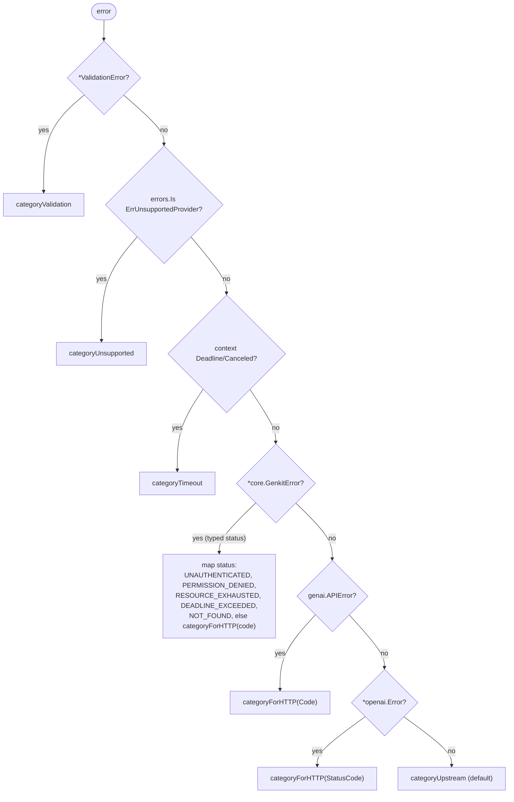

# Error handling

The proxy follows one rule: **caller mistakes are reported verbatim; upstream
provider failures are reduced to generic, category-based messages** so internal
details (provider identifiers, raw SDK errors, keys) never leak to the client.
The full error is always written to the server log; only the safe message
reaches the caller.

Three functions cooperate:

- `classify(err)` — maps any error to a coarse `errCategory` (`errors.go:52`).
- `statusFor(err)` — maps the category to an HTTP status (`proxy.go:95`).
- `safeMessage(err)` — maps the category to a client-safe string (`errors.go:119`).

## Classification

`classify` prefers typed extraction over string matching, in this precedence
order. The first match wins.

`categoryForHTTP` translates a provider HTTP status code into a category
(`errors.go:99`):

| Provider status | Category |
|-----------------|----------|
| `401` | `categoryUnauthenticated` |
| `403` | `categoryPermissionDenied` |
| `429` | `categoryRateLimit` |
| `408`, `504` | `categoryTimeout` |
| `404` | `categoryNotFound` |
| anything else | `categoryUpstream` |

Note the provider coverage: `googleai` and `vertexai` surface as a typed
`*core.GenkitError` (with a raw `genai.APIError` fallback) — both use the
`googlegenai` plugin; `openai` and `anthropic` both surface as `*openai.Error`
(the Anthropic plugin is OpenAI-compatible).

## Category → status → message

| Category | HTTP status | Client message |
|----------|-------------|----------------|
| `categoryValidation` | `400` | the validation error, verbatim |
| `categoryUnsupported` | `400` | the unsupported-provider error, verbatim |
| `categoryUnauthenticated` | `401` | `upstream provider rejected the supplied credentials` |
| `categoryPermissionDenied` | `403` | `upstream provider denied access` |
| `categoryRateLimit` | `429` | `upstream provider rate limit exceeded` |
| `categoryTimeout` | `504` | `upstream provider request timed out` |
| `categoryNotFound` | `404` | `requested model was not found` |
| `categoryUpstream` | `502` | `upstream provider error` |

Only `categoryValidation` and `categoryUnsupported` echo the underlying error
text — those are caller-caused and safe. Every other category returns a fixed
string.

## Where errors originate

- **Before any provider call** (handled directly in `proxy.go`, not via
  `classify`): a non-`POST` method → `405`; a missing/malformed bearer token →
  `401` (`ErrMissingCredentials`); an unparseable or oversized body → `400`.
- **During validation** (`request.go`): empty `modelName`, neither `userMessage`
  nor `messages`, an out-of-range tuning field (`temperature`, `maxOutputTokens`,
  `topP`, `topK`), an invalid `responseFormat` or `outputSchema` without
  `responseFormat:"json"`, a malformed `messages` entry (bad role, not exactly one
  of `content`/`parts`, a `parts` entry not exactly one of
  `text`/`media`/`toolRequest`/`toolResponse`, `media` missing
  `contentType`/`url`, or a tool part missing `name`), a `tools` entry with a
  missing or duplicate `name`, an invalid `toolChoice`, or an unknown provider
  prefix → `400`.
- **During generation** (`generator.go` → provider SDK): everything classified
  by the tree above.

## Logging

When a generation fails with a category at or above `categoryUnauthenticated`,
the handler logs an `ERROR` with the model, mapped status, full error, and
request ID before writing the sanitized response (`proxy.go:64-71`). Validation
and unsupported-provider errors are caller-facing and are not logged at error
level. See [observability](observability.md).
