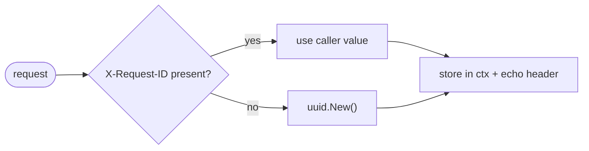
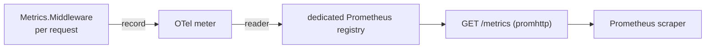

# Observability

The proxy emits structured logs and Prometheus metrics, and propagates a
per-request ID. All three are wired through the middleware chain
(`middleware.go`, `metrics.go`) described in [architecture](architecture.md).

## Request IDs

`RequestID` reads `X-Request-ID` from the inbound request, or generates a UUID
v4 when absent. The ID is stored in the request context and echoed back in the
`X-Request-ID` response header, so a caller can correlate its request with the
server logs (`middleware.go:56`).

## Logging

Logging uses the standard library `log/slog`. The `Authorization` header is
never logged.

`Logger` writes one `INFO` access-log line per completed request
(`middleware.go:70`):

| Field | Source |
|-------|--------|
| `method` | request method |
| `path` | request path |
| `status` | first status written (defaults to `200`) |
| `latency_ms` | wall time across the handler |
| `request_id` | the request ID above |
| `model` | the decoded `modelName` — only present for generation requests |

The `model` field works via a mutable `modelSlot` that `Logger` installs in the
context; the `Handler` fills it in after decoding the body. This same slot is
reused by the metrics middleware (see below).

On a failed generation (category ≥ `categoryUnauthenticated`) the handler also
emits an `ERROR` line with `model`, `status`, the full `err`, and `request_id`
before returning the sanitized response (`proxy.go:64`). See
[error handling](error-handling.md).

`Recover` logs a `panic recovered` `ERROR` (with `request_id`) if a handler
panics, then returns a `500` when the response has not yet started
(`middleware.go:32`).

## Metrics

`Metrics` (`metrics.go`) is backed by an OpenTelemetry meter whose data is
exported through a **dedicated** Prometheus registry, so `GET /metrics` contains
only this service's metrics (scope and target info are disabled).

Three instruments. The two request metrics are labelled by `method`, `status`,
and `provider`; the token counter is labelled by `provider` and `kind`:

| Metric | Type | Unit | Labels | Description |
|--------|------|------|--------|-------------|
| `http_requests` | Int64 counter | requests | `method`, `status`, `provider` | Total HTTP requests handled. |
| `http_request_duration` | Float64 histogram | seconds | `method`, `status`, `provider` | Request latency. |
| `llm_tokens` | Int64 counter | tokens | `provider`, `kind` | Tokens consumed by generations. |

In the Prometheus exposition the counters appear with the `_total` suffix
(`http_requests_total`, `llm_tokens_total`).

Histogram buckets (seconds), spanning fast probes through slow generations:
`0.05, 0.1, 0.25, 0.5, 1, 2, 5, 10, 20, 30, 60` (`metrics.go:24`).

The `provider` label is the model-name prefix (`googleai`, `openai`,
`anthropic`, `vertexai`), or empty for non-generation routes such as health
checks (`providerLabel`, `metrics.go:125`).

`llm_tokens_total` is recorded only for generations that report usage, with one
series per `kind` — `input` and `output` (no `total`; it is derivable). It is
not emitted for non-generation routes. The counts come from the same per-request
usage surfaced in the response `usage` field, threaded to the metrics middleware
through the shared `modelSlot`.

### Ordering dependency

`Metrics.Middleware` reads the provider from the `modelSlot` that `Logger`
installs, so it must run **inside** `Logger` in the chain
(`Recover → RequestID → Logger → Metrics.Middleware → mux`, `main.go:65`). If
`Logger` is absent it installs its own slot as a fallback
(`metrics.go:95-103`), so metrics still record — just without the `model`
correlation in logs.
